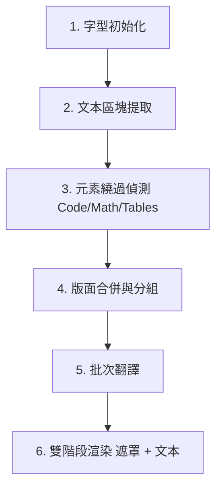

# PDF 翻譯模組：架構與重構檢討文件

本文件對 C# PDF 翻譯模組（`Clickra.Core`）進行了全面性的分析。詳細列出了目前的管線步驟、提取與渲染機制、已知的排版與翻譯 Bug 原因，並為後續的程式碼清理與重構提供了清晰的規劃路徑。

---

## 1. 架構管線流程概述

翻譯的進入點為 [FileProcessor.TranslatePdf](../src/Clickra.Core/FileProcessor.cs#L305)。整體工作流程遵循以下 6 個 distinct 階段：

| 階段 | 職責說明 | 關鍵類別 / 方法 |
| :--- | :--- | :--- |
| **1. 字型初始化** | 為 PDFsharp 在 Windows 上設定 CJK 字型對應（如微軟正黑體） | [ClickraFontResolver](../src/Clickra.Core/ClickraFontResolver.cs) |
| **2. 文本提取** | 字詞提取與 Segmenter 區塊解析 | `NearestNeighbourWordExtractor`, `DocstrumBoundingBoxes` |
| **3. 元素繞過** | 偵測不應翻譯的程式碼、數學公式、表格 | `IsCode`, `IsOnlyMath`, `IsEquationParagraph`, `MarkTableParagraphs` |
| **4. 版面合併** | 合併被分割的參考文獻或清單項目之多行/區塊 | `MergeHorizontalLines`, `MergeVerticallyAdjacentParagraphs` |
| **5. 批次翻譯** | 將每頁的 CJK 文本打包透過 API 批次翻譯 | `ITranslationEngine`, `GoogleFreeTranslator` |
| **6. 渲染與疊加** | 先繪製白色背景遮罩，再於上方渲染翻譯後文本 | `gfx.DrawRectangle` (Pass 1), `RenderParagraph` (Pass 2) |

---

## 2. 現有機制詳細說明

### A. 字詞與邊界框提取
- **字詞提取**：使用 UglyToad.PdfPig 的 `NearestNeighbourWordExtractor` 處理原始字元（Letters）。
- **區塊分割**：使用 `DocstrumBoundingBoxes` 將字詞分割為不同的版面區塊（Blocks）。
- **水平合併**：在每個區塊內，將位於同一水平高度（質心 Y 座標差異 < 3.5 pt）的水平片段透過 `MergeHorizontalLines` 進行合併，防止數學符號或上標被拆成獨立行。
- **大空隙拆段**：若前一行底部與當前行頂部垂直間距 > 15 pt（`isVerticalGapLarge`），強制拆成獨立段落，防止 Docstrum 跨區塊誤合併。
- **數學行分割**：區塊內的文本行會透過 `IsMathLine` 檢查。當行與行之間在數學公式和普通正文之間轉換時，會將區塊拆分成多個 `PdfParagraph` 物件，以將數學方程式獨立出來。

### B. 元素繞過（保留英文原文元素）
- **數學公式與方程式**：
  - `IsMathLine` 會檢查字元的字型名稱是否符合數學字型前綴（例如 `CMMI`, `CMSY`）以及 Unicode 範圍。
  - `IsEquationParagraph` 會繞過看起來像數學公式或結尾帶有方程式索引（如 `(1)`）的段落。
- **程式碼區塊**：若段落字型為等寬字型（如 Courier, Console, Inconsolata），則會判定為程式碼並繞過。
- **第一頁作者區塊**：top-band 候選先依來源視覺字級、再依寬度選出真正論文標題，避免較寬的出版頁首取代標題；以 `titleBottom = titlePara.Y0` 與 `abstractTop = abstractPara.Y1` 界定 bypass 區間，條件為 `para.Y0 >= abstractTop && para.Y1 <= titleBottom`（PDFPig Y 軸向上）。
- **表格（幾何表格識別）**：
  - `IsTableCaptionWord` 判定頁面是否為表格頁（排除引言中的 "Table"/"表"）。
  - `IsTableParagraph` 會檢查關鍵字密度與高密度數字/短標記（Numeric/Short tokens）。
  - `MarkTableParagraphs` 會在幾何上對水平和垂直對齊（間距 < 45 pt）的小型候選儲存格段落進行分組。若一組內包含 $\ge 4$ 個儲存格，則識別為表格，並繞過該表格邊界框（含 15 pt 邊距）內所有字數 $\le 150$ 的段落。

### C. 版面合併與排序
- **垂直合併**：`MergeVerticallyAdjacentParagraphs` 將頁面上的段落由上至下排序。若同一個欄位內（水平重疊率 > 60%）的兩個段落垂直間距 ≤ 6 pt，且**至少一方為參考文獻或清單項目**，則透過 `p1.MergeWith(p2)` 進行合併。一般正文段落永不合併。
- **StartsNewParagraphOrSection**：作為守門條件，防止在下一個段落是新的清單項目、參考文獻或標題時進行錯誤合併。
- **換行碎片例外**：`MergeWrappedLineFragments` 僅處理同欄、同左錨點、相近字級且垂直間距 -1 至 8 pt 的普通可譯碎片；圖說、標題、表格、程式碼、公式、灰框、參考文獻與新段落起始一律停止。這不是通用正文合併。

### D. 翻譯客戶端
- **Google 行動翻譯 API**：在 `TranslationEngine.cs` 中實作。透過在一次 POST 請求中傳遞多個 `q` 參數來進行批次翻譯（`TranslateBatchAsync`），並包含自動重試與單段落循序翻譯的降級機制。

### E. 文本與公式渲染
- **雙階段繪製（Two-Pass Drawing）**：
  - Pass 1：先在原始英文文本邊界上繪製實心白色矩形（`XBrushes.White`）。
  - Pass 2：在遮罩上方渲染翻譯後的文本。這可防止白色背景遮罩意外覆蓋相鄰已繪製的文字。
  - **固定向量容器例外**：Findings／研究結果圓角框是「可翻譯文字 + 固定背景與邊線」容器。其遮罩不得擴展到整欄或覆蓋框線；若需要清除原文，必須保留至少 1 pt 邊界，或先依來源幾何重繪底色與圓角邊框，再繪製譯文。
- **正常混合狀態**：將 `/NormalState gs` 附加至頁面的 ExtGStates 中，以重設疊印（Overprint）或混合模式問題。
- **公式還原**：
  - 提取階段抽離的公式會以 `{v0}`, `{v1}` 等預留位置表示。
  - 渲染時，`TokenizeTranslatedText` 會將文本拆回普通字詞與預留位置。
  - 預留位置字元會藉由在其精確相對位置上，使用 `Segoe UI Symbol` 或數學字型重新繪製原始字元（`MathLetter`）來還原。
- **動態文本縮放**：一般多行正文可在 80% 下限內 reflow；單行／續行不得因來源 bbox 過矮而縮成小字，改沿用同欄正文有效字級。若自然行高撞到固定區則 fail closed。
- **同欄垂直平衡**：CJK 正文以自然高度進入 layout planning，在表格、圖表、程式碼、公式、灰框、作者區、文獻與頁界所切出的 flow region 內共同調整。正文比例限制為 80%–115%、行距倍率不超過 1.50，未分配空白不超過 18 pt；不跨欄、不跨頁，且遮罩／連結／診斷沿用調整後座標。
- **段落裁切（Clip）**：禁止以圖表/欄位的外層 `IntersectClip` 靜默截斷譯文；renderer 內部只保護自身段落邊界，任何 overflow 都使 health gate 失敗。

---

## 3. 已修復 Bug 記錄

> [!NOTE]
> 以下結構性 Bug 已於 `feature/pdf-layout-fixes` 分支修復。

### ✅ Bug A：正文與章節標題的「過度合併」（已修復）
- **原問題**：`MergeVerticallyAdjacentParagraphs` 對所有相鄰段落（gap ≤ 14 pt）執行合併，雙欄論文中 8–10 pt 的段落間距被誤判為同一文獻折行，產生 300+ 字巨型段落，導致 API 截斷或粗體比例不足。
- **修復**：
  1. 限縮合併：僅當 `p1` 或 `p2` 為參考文獻（`IsReferenceParagraph`）或清單/章節起始（`StartsNewParagraphOrSection`）時才合併。
  2. 提取階段恢復 `isVerticalGapLarge > 15 pt` 強制拆段。

### ✅ Bug B：標題識別正則表達式過於嚴格（已修復）
- **原問題**：舊 regex `^\d+(\.\d+)*\.\s+[A-Z]` 要求數字結尾必須帶點，無法匹配 `3.1 Text Encoder` 等子標題。
- **修復**：放寬為 `^\d{1,2}(?:\.\d{1,2}){0,4}\.?(?:\s+[^a-z]|$)`，支援可選尾點與小寫開頭子標題。

### ✅ Bug C：譯文垂直裁切（已修復）
- **原問題**：diagram/雙欄保護的外層 `IntersectClip` 會在流程成功時靜默刪除多行中文譯文。
- **修復**：移除外層 guard clip，改由段落 reflow、縮放與遮罩幾何處理；`GuardClipEntries` 必須為 0，renderer 的 overflow 也會阻止正式輸出。

### ✅ Bug D：第一頁 Author Block bypass 條件錯誤（已修復）
- **原問題**：誤用 `para.Y0 > abstractY0` 或顛倒的 Y 軸條件，導致 Abstract 正文被整段跳過。
- **修復**：標題篩選 `para.Y1 > page.Height * 0.5`；bypass 區間 `para.Y0 >= abstractTop && para.Y1 <= titleBottom`（`abstractTop = abstractPara.Y1`，`titleBottom = titlePara.Y0`）。

---

## 4. 後續清理項目

- `AdjustParagraphLayout` 已移除空方法與呼叫（原為無作用佔位）。
- 嚴禁呼叫 `StripFormXObjects`（死碼，會破壞向量圖表）。
- `ClickraFontResolver`：CJK 翻譯固定使用 `kaiu.ttf`；來源粗體範圍以 inline markers 傳遞，renderer 以 0.18 pt 二次描繪保留字重，避免 TTC/SimSun-ExtB 亂碼。

---

## 5. 驗收基準（2407.11279v1_clean.pdf）

- 第 1 頁 Abstract 正文有中文譯文
- 第 1 頁作者/機構資訊保持英文
- 譯文無垂直裁切
- 子標題如 `3.1 ...` 有粗體
- 雙欄正文各自獨立翻譯，無跨欄溢出
- 表格/圖表區域未被白遮罩破壞
- Figure/Fig. 圖說可翻譯，但其增高遮罩必須在圖表底邊前停止，不得擦除圖表底部向量線
- Findings 5/6 等可翻譯圓角框的底色與四邊邊線完整保留
## v3.6.4 reliability and layout gate

The PDF pipeline now treats translation as a recoverable operation: failed batches
are recursively split, then retried per paragraph through the configured provider
fallback chain. Each provider call has its own 30-second budget, while the
two-provider chain has a separate default 75-second budget (overridable by the
translation timeout settings) so a primary retry cannot
cancel the fallback prematurely. The document is bounded to 10 minutes. A failed
paragraph is reported rather than silently copied back into a successful-looking
output.

Rebuilds are written to a `.partial` path and renamed only after page-count and
layout health checks pass. Paragraph rendering reflows and scales translated text
before drawing; broad diagram/column guard clips are disabled because they silently
delete translated lines. Diagram protection is handled by mask geometry, and both
`GuardClipEntries` and actual horizontal/vertical overflow are hard health failures.
The planner records measured anchor drift and reports fixed-region collisions
from layout exceptions instead of hard-coding zero. Each run emits a
`*_health.json` report for automation and regression review.

### v3.6.4 heading layout planning

Before masks are drawn, `PdfTranslationLayoutPlanner` captures each paragraph's
source role, visual font size, line height, column, and left/center/right anchor.
Page titles and section headings retain that source font size; a merged title /
subtitle group uses the main title size rather than an average. Single-line
headings use the captured geometric anchor instead of the extracted text-box
alignment.

If a heading gains height, only translatable body paragraphs below it in the
same column may move. Author metadata, figures, tables, code, formulas, gray
prompts, references, and running headers/footers are fixed obstacles. A fixed
region or page-bottom collision raises a layout planning failure before the
`.partial` PDF can be renamed. No cross-column, whole-page, cross-page, or clip
based hiding is permitted. The health report records heading counts, heading
font ratios, anchor offsets, shifted paragraphs, fixed collisions, bottom
overflow, and the failure reason.

The release gate for 3.6.4 is ASTER (12 pages) plus the four maintained PDF
fixtures: page count unchanged, no tofu/overflow/clipping, all translatable
paragraphs translated, heading font ratio not below 1.0, anchor drift no more
than 1.5 pt, and no suspicious mask overlap.
