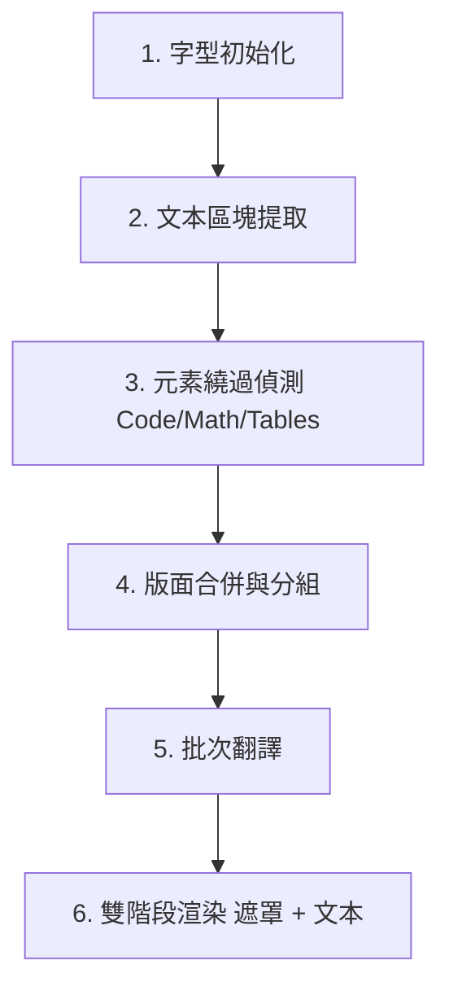

# PDF 翻譯模組：架構與重構檢討文件

本文件對 C# PDF 翻譯模組（`Clickra.Core`）進行了全面性的分析。詳細列出了目前的管線步驟、提取與渲染機制、已知的排版與翻譯 Bug 原因，並為後續的程式碼清理與重構提供了清晰的規劃路徑。

---

## 1. 架構管線流程概述

翻譯的進入點為 [FileProcessor.TranslatePdf](../src/Clickra.Core/FileProcessor.cs#L305)。整體工作流程遵循以下 6 個 distinct 階段：

| 階段 | 職責說明 | 關鍵類別 / 方法 |
| :--- | :--- | :--- |
| **1. 字型初始化** | 為 PDFsharp 在 Windows 上設定 CJK 字型對應（如微軟正黑體） | [ClickraFontResolver](../src/Clickra.Core/ClickraFontResolver.cs) |
| **2. 文本提取** | 字詞提取與 Segmenter 區塊解析 | `NearestNeighbourWordExtractor`, `DocstrumBoundingBoxes` |
| **3. 元素繞過** | 偵測不應翻譯的程式碼、數學公式、表格 | `IsCode`, `IsOnlyMath`, `IsEquationParagraph`, `MarkTableParagraphs` |
| **4. 版面合併** | 合併被分割的參考文獻或清單項目之多行/區塊 | `MergeHorizontalLines`, `MergeVerticallyAdjacentParagraphs` |
| **5. 批次翻譯** | 將每頁的 CJK 文本打包透過 API 批次翻譯 | `ITranslationEngine`, `GoogleFreeTranslator` |
| **6. 渲染與疊加** | 先繪製白色背景遮罩，再於上方渲染翻譯後文本 | `gfx.DrawRectangle` (Pass 1), `RenderParagraph` (Pass 2) |

---

## 2. 現有機制詳細說明

### A. 字詞與邊界框提取
- **字詞提取**：使用 UglyToad.PdfPig 的 `NearestNeighbourWordExtractor` 處理原始字元（Letters）。
- **區塊分割**：使用 `DocstrumBoundingBoxes` 將字詞分割為不同的版面區塊（Blocks）。
- **水平合併**：在每個區塊內，將位於同一水平高度（質心 Y 座標差異 < 3.5 pt）的水平片段透過 `MergeHorizontalLines` 進行合併，防止數學符號或上標被拆成獨立行。
- **大空隙拆段**：若前一行底部與當前行頂部垂直間距 > 15 pt（`isVerticalGapLarge`），強制拆成獨立段落，防止 Docstrum 跨區塊誤合併。
- **數學行分割**：區塊內的文本行會透過 `IsMathLine` 檢查。當行與行之間在數學公式和普通正文之間轉換時，會將區塊拆分成多個 `PdfParagraph` 物件，以將數學方程式獨立出來。

### B. 元素繞過（保留英文原文元素）
- **數學公式與方程式**：
  - `IsMathLine` 會檢查字元的字型名稱是否符合數學字型前綴（例如 `CMMI`, `CMSY`）以及 Unicode 範圍。
  - `IsEquationParagraph` 會繞過看起來像數學公式或結尾帶有方程式索引（如 `(1)`）的段落。
- **程式碼區塊**：若段落字型為等寬字型（如 Courier, Console, Inconsolata），則會判定為程式碼並繞過。
- **第一頁作者區塊**：以 `titleY1`（最大字型標題底部）與 `abstractY0`（ABSTRACT 頂部）界定 bypass 區間，條件為 `para.Y0 >= abstractY0 && para.Y1 <= titleY1`（PDFPig Y 軸向上）。
- **表格（幾何表格識別）**：
  - `IsTableCaptionWord` 判定頁面是否為表格頁（排除引言中的 "Table"/"表"）。
  - `IsTableParagraph` 會檢查關鍵字密度與高密度數字/短標記（Numeric/Short tokens）。
  - `MarkTableParagraphs` 會在幾何上對水平和垂直對齊（間距 < 45 pt）的小型候選儲存格段落進行分組。若一組內包含 $\ge 4$ 個儲存格，則識別為表格，並繞過該表格邊界框（含 15 pt 邊距）內所有字數 $\le 150$ 的段落。

### C. 版面合併與排序
- **垂直合併**：`MergeVerticallyAdjacentParagraphs` 將頁面上的段落由上至下排序。若同一個欄位內（水平重疊率 > 60%）的兩個段落垂直間距 ≤ 6 pt，且**至少一方為參考文獻或清單項目**，則透過 `p1.MergeWith(p2)` 進行合併。一般正文段落永不合併。
- **StartsNewParagraphOrSection**：作為守門條件，防止在下一個段落是新的清單項目、參考文獻或標題時進行錯誤合併。

### D. 翻譯客戶端
- **Google 行動翻譯 API**：在 `TranslationEngine.cs` 中實作。透過在一次 POST 請求中傳遞多個 `q` 參數來進行批次翻譯（`TranslateBatchAsync`），並包含自動重試與單段落循序翻譯的降級機制。

### E. 文本與公式渲染
- **雙階段繪製（Two-Pass Drawing）**：
  - Pass 1：先在原始英文文本邊界上繪製實心白色矩形（`XBrushes.White`）。
  - Pass 2：在遮罩上方渲染翻譯後的文本。這可防止白色背景遮罩意外覆蓋相鄰已繪製的文字。
- **正常混合狀態**：將 `/NormalState gs` 附加至頁面的 ExtGStates 中，以重設疊印（Overprint）或混合模式問題。
- **公式還原**：
  - 提取階段抽離的公式會以 `{v0}`, `{v1}` 等預留位置表示。
  - 渲染時，`TokenizeTranslatedText` 會將文本拆回普通字詞與預留位置。
  - 預留位置字元會藉由在其精確相對位置上，使用 `Segoe UI Symbol` 或數學字型重新繪製原始字元（`MathLetter`）來還原。
- **動態文本縮放**：若翻譯後的文本版面高度超出原始邊界框高度，優先壓縮行高，再縮小字型（最低 0.8）。
- **段落裁切（Clip）**：`IntersectClip` 在縮放與 `renderedHeight` 計算後設定。水平以 `layoutWidth` 防雙欄溢出；垂直以 `Math.Max(paragraphHeight, renderedHeight)` 防譯文被切半。

---

## 3. 已修復 Bug 記錄

> [!NOTE]
> 以下結構性 Bug 已於 `feature/pdf-layout-fixes` 分支修復。

### ✅ Bug A：正文與章節標題的「過度合併」（已修復）
- **原問題**：`MergeVerticallyAdjacentParagraphs` 對所有相鄰段落（gap ≤ 14 pt）執行合併，雙欄論文中 8–10 pt 的段落間距被誤判為同一文獻折行，產生 300+ 字巨型段落，導致 API 截斷或粗體比例不足。
- **修復**：
  1. 限縮合併：僅當 `p1` 或 `p2` 為參考文獻（`IsReferenceParagraph`）或清單/章節起始（`StartsNewParagraphOrSection`）時才合併。
  2. 提取階段恢復 `isVerticalGapLarge > 15 pt` 強制拆段。

### ✅ Bug B：標題識別正則表達式過於嚴格（已修復）
- **原問題**：舊 regex `^\d+(\.\d+)*\.\s+[A-Z]` 要求數字結尾必須帶點，無法匹配 `3.1 Text Encoder` 等子標題。
- **修復**：放寬為 `^\d{1,2}(?:\.\d{1,2}){0,4}\.?(?:\s+[^a-z]|$)`，支援可選尾點與小寫開頭子標題。

### ✅ Bug C：譯文垂直裁切（已修復）
- **原問題**：`IntersectClip` 在縮放前以原始英文 `paragraphHeight` 裁切，多行中文譯文下半段被切掉。
- **修復**：clip 移至縮放/`renderedHeight` 計算後；`clipH = Math.Max(paragraphHeight, renderedHeight) + 3 pt`；水平 `clipW = layoutWidth + 3 pt`。

### ✅ Bug D：第一頁 Author Block bypass 條件錯誤（已修復）
- **原問題**：誤用 `para.Y0 > abstractY0` 或顛倒的 Y 軸條件，導致 Abstract 正文被整段跳過。
- **修復**：標題篩選 `para.Y1 > page.Height * 0.5`；bypass 區間 `para.Y0 >= abstractTop && para.Y1 <= titleBottom`（`abstractTop = abstractPara.Y1`，`titleBottom = titlePara.Y0`）。

---

## 4. 後續清理項目

- `AdjustParagraphLayout` 已移除空方法與呼叫（原為無作用佔位）。
- 嚴禁呼叫 `StripFormXObjects`（死碼，會破壞向量圖表）。
- `ClickraFontResolver`：`msjh`/`dfkai-sb` 粗體映射至 `simsunb.ttf`，避免 simulated bold 亂碼。

---

## 5. 驗收基準（2407.11279v1_clean.pdf）

- 第 1 頁 Abstract 正文有中文譯文
- 第 1 頁作者/機構資訊保持英文
- 譯文無垂直裁切
- 子標題如 `3.1 ...` 有粗體
- 雙欄正文各自獨立翻譯，無跨欄溢出
- 表格/圖表區域未被白遮罩破壞
