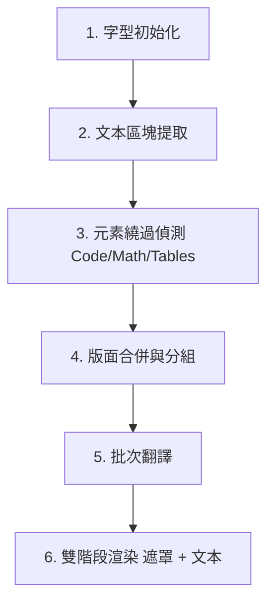

# PDF 翻譯模組：架構與重構檢討文件

本文件對 C# PDF 翻譯模組（`Clickra.Core`）進行了全面性的分析。詳細列出了目前的管線步驟、提取與渲染機制、已知的排版與翻譯 Bug 原因，並為後續的程式碼清理與重構提供了清晰的規劃路徑。

---

## 1. 架構管線流程概述

翻譯的進入點為 [FileProcessor.TranslatePdf](../src/Clickra.Core/FileProcessor.cs#L305)。整體工作流程遵循以下 6 個 distinct 階段：



| 階段 | 職責說明 | 關鍵類別 / 方法 |
| :--- | :--- | :--- |
| **1. 字型初始化** | 為 PDFsharp 在 Windows 上設定 CJK 字型對應（如微軟正黑體） | [ClickraFontResolver](../src/Clickra.Core/ClickraFontResolver.cs) |
| **2. 文本提取** | 字詞提取與 Segmenter 區塊解析 | `NearestNeighbourWordExtractor`, `DocstrumBoundingBoxes` |
| **3. 元素繞過** | 偵測不應翻譯的程式碼、數學公式、表格 | `IsCode`, `IsOnlyMath`, `IsEquationParagraph`, `MarkTableParagraphs` |
| **4. 版面合併** | 合併被分割的參考文獻或清單項目之多行/區塊 | `MergeHorizontalLines`, `MergeVerticallyAdjacentParagraphs` |
| **5. 批次翻譯** | 將每頁的 CJK 文本打包透過 API 批次翻譯 | `ITranslationEngine`, `GoogleFreeTranslator` |
| **6. 渲染與疊加** | 先繪製白色背景遮罩，再於上方渲染翻譯後文本 | `gfx.DrawRectangle` (Pass 1), `RenderParagraph` (Pass 2) |

---

## 2. 現有機制詳細說明

### A. 字詞與邊界框提取
- **字詞提取**：使用 UglyToad.PdfPig 的 `NearestNeighbourWordExtractor` 處理原始字元（Letters）。
- **區塊分割**：使用 `DocstrumBoundingBoxes` 將字詞分割為不同的版面區塊（Blocks）。
- **水平合併**：在每個區塊內，將位於同一水平高度（質心 Y 座標差異 < 3.5 pt）的水平片段透過 `MergeHorizontalLines` 進行合併，防止數學符號或上標被拆成獨立行。
- **數學行分割**：區塊內的文本行會透過 `IsMathLine` 檢查。當行與行之間在數學公式和普通正文之間轉換時，會將區塊拆分成多個 `PdfParagraph` 物件，以將數學方程式獨立出來。

### B. 元素繞過（保留英文原文元素）
- **數學公式與方程式**：
  - `IsMathLine` 會檢查字元的字型名稱是否符合數學字型前綴（例如 `CMMI`, `CMSY`）以及 Unicode 範圍。
  - `IsEquationParagraph` 會繞過看起來像數學公式或結尾帶有方程式索引（如 `(1)`）的段落。
- **程式碼區塊**：若段落字型為等寬字型（如 Courier, Console, Inconsolata），則會判定為程式碼並繞過。
- **表格（幾何表格識別）**：
  - `IsTableParagraph` 會檢查關鍵字密度與高密度數字/短標記（Numeric/Short tokens）。
  - `MarkTableParagraphs` 會在幾何上對水平和垂直對齊（間距 < 45 pt）的小型候選儲存格段落進行分組。若一組內包含 $\ge 4$ 個儲存格，則識別為表格，並繞過該表格邊界框（含 15 pt 邊距）內所有字數 $\le 150$ 的段落。

### C. 版面合併與排序
- **垂直合併**：`MergeVerticallyAdjacentParagraphs` 將頁面上的段落由上至下排序。若同一個欄位內（水平重疊率 > 60%）的兩個段落垂直間距 < 14 pt，則會透過 `p1.MergeWith(p2)` 進行合併。
- **StartsNewParagraphOrSection**：作為守門條件，防止在下一個段落是新的清單項目、參考文獻或標題時進行錯誤合併。

### D. 翻譯客戶端
- **Google 行動翻譯 API**：在 `TranslationEngine.cs` 中實作。透過在一次 POST 請求中傳遞多個 `q` 參數來進行批次翻譯（`TranslateBatchAsync`），並包含自動重試與單段落循序翻譯的降級機制。

### E. 文本與公式渲染
- **雙階段繪製（Two-Pass Drawing）**：
  - Pass 1：先在原始英文文本邊界上繪製實心白色矩形（`XBrushes.White`）。
  - Pass 2：在遮罩上方渲染翻譯後的文本。這可防止白色背景遮罩意外覆蓋相鄰已繪製的文字。
- **正常混合狀態**：將 `/NormalState gs` 附加至頁面的 ExtGStates 中，以重設疊印（Overprint）或混合模式問題。
- **公式還原**：
  - 提取階段抽離的公式會以 `{v0}`, `{v1}` 等預留位置表示。
  - 渲染時，`TokenizeTranslatedText` 會將文本拆回普通字詞與預留位置。
  - 預留位置字元會藉由在其精確相對位置上，使用 `Segoe UI Symbol` 或數學字型重新繪製原始字元（`MathLetter`）來還原。
- **動態文本縮放**：若翻譯後的文本版面高度超出原始邊界框高度，字型大小會自動縮小（最大縮小至 80%）以貼合邊界。

---

## 3. 當前 Bug 與架構問題分析

> [!WARNING]
> 目前系統中存在兩個主要的結構性 Bug，導致排版失效與翻譯遺漏。

### 🔴 Bug A：正文與章節標題的「過度合併」
- **問題點**：`MergeVerticallyAdjacentParagraphs` 的判定過於寬鬆。在雙欄論文中，連續段落之間的垂直間距非常小（通常僅 8-10 pt）。合併演算法將這種緊密的垂直間距誤判為同一個文獻/項目的多行折行，從而將它們強行合併。
- **後果**：
  1. 多個獨立的正文段落與標題被合併成了一個包含 300 多個單字的巨大段落。
  2. 超長文本導致 Google 翻譯 API 混亂，產生截斷或返回未翻譯的英文原文（如第四頁所示）。
  3. 章節標題被普通正文稀釋，導致粗體比例低於 50%，丟失了粗體樣式。

### 🔴 Bug B：標題識別正則表達式（Regex）過於嚴格
- **問題點**：`IsHeadingParagraph` 目前使用的正則表達式為：
  ```csharp
  System.Text.RegularExpressions.Regex.IsMatch(txt, @"^\d+(\.\d+)*\.\s+[A-Z]")
  ```
  這要求標題的數字結尾**必須帶有一個點**（例如 `3. METHODOLOGY` 匹配），但在遇到常見的巢狀子標題如 `3.1 Text Encoder` 或 `3.1.1 Adaptation`（結尾沒有點）時就會匹配失敗。
- **後果**：所有的子標題段落都無法被識別為標題，因此被渲染為普通字型，失去粗體外觀。

---

## 4. 重構與清理規劃路徑

為了解決這些問題並使程式碼更加乾淨、健壯，我們將執行以下重構計畫：

### 📋 階段 1：限縮段落合併邏輯（目前先不動手）
- **具體作法**：限制 `MergeVerticallyAdjacentParagraphs`，僅在**其中一個段落是參考文獻或清單項目**時才執行合併。
- **程式碼調整**：
  ```csharp
  // 僅在任一段落是文獻（IsReferenceParagraph）或清單項目（StartsNewParagraphOrSection）時才執行合併
  bool isP1RefOrList = IsReferenceParagraph(p1) || StartsNewParagraphOrSection(p1.TextWithPlaceholders);
  bool isP2RefOrList = IsReferenceParagraph(p2) || StartsNewParagraphOrSection(p2.TextWithPlaceholders);
  if (!isP1RefOrList && !isP2RefOrList) continue;
  ```

### 📋 階段 2：更新標題識別正則
- **具體作法**：放寬正則，允許標題數字結尾的點為可選項。
- **程式碼調整**：
  ```csharp
  // 支援 "3. METHODOLOGY", "3.1 Text", "3.1.1 Adaptation"
  if (System.Text.RegularExpressions.Regex.IsMatch(txt, @"^\d+(\.\d+)*\.?\s+[A-Z]")) return true;
  ```

### 📋 階段 3：刪除無用程式碼
- **具體作法**：徹底刪除 `FileProcessor.cs` 中已廢棄且無作用的 `AdjustColumnParagraphs` 輔助方法。
- **具體作法**：將 `AdjustParagraphLayout` 的內容維持清空狀態或完全移除相關呼叫。

---

## 5. 待決策與討論事項

在我們進入執行階段前，請您檢視並確認以下設計決策：

1. **合併範疇限縮**：您是否同意將垂直段落合併限定在「文獻」與「清單」？（這將防止正文段落相互合併，保持翻譯文本區塊的精確與小巧）。
2. **標題粗體樣式**：您是否同意放寬正則以恢復子標題的粗體樣式？
